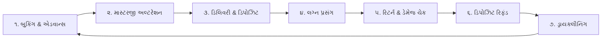

# 👑 Rent360 - સંપૂર્ણ ૩૬૦° રેન્ટલ ERP સોફ્ટવેર

> **પ્રોડક્ટ નેમ:** **`Rent360`** (A 360° Rental Business Solution by InfoFriends Technology | Powered by Info360)  
> **કંપની:** **InfoFriends Technology**  
> **પ્રોડક્ટ હેડ / સ્થાપક:** યશ બાબરિયા (Yash Babariya)  
> **પ્રથમ પાયલોટ:** વિરાસત ફેશન સ્ટુડિયો (Virasat Fashion Studio)  
> **કિંમત:** ₹૯,૯૯૯ / વર્ષ (માર્કેટમાં ₹૧૫,૯૯૯ વાળા જૂના Rentopus નો આધુનિક, ઝડપી અને સંપૂર્ણ ૩૬૦° વિકલ્પ)

---

## 📑 અનુક્રમણિકા (Index)
1. [પ્રસ્તાવના અને પ્રોડક્ટ મિશન](#1-પ્રસ્તાવના-અને-પ્રોડક્ટ-મિશન)
2. [રેન્ટલ બિલિંગ & કસ્ટમ PDF/Thermal ઇન્વોઇસ ડિઝાઇનર (ઊંડાણપૂર્વક)](#2-રેન્ટલ-બિલિંગ--કસ્ટમ-ઇન્વોઇસ-ડિઝાઇનર)
3. [Rentopus ના તમામ ૫૨ સ્ક્રીન્સનું વિગતવાર પૃથ્થકરણ (Screen-by-Screen Deep Dive)](#3-તમામ-૫૨-સ્ક્રીન્સનું-વિગતવાર-પૃથ્થકરણ)
4. [પોઇન્ટ-ટુ-પોઇન્ટ સરખામણી (Rentopus vs. RentElite OS)](#4-પોઇન્ટ-ટુ-પોઇન્ટ-સરખામણી)
5. [દુકાનદારની વાસ્તવિક સમસ્યાઓ અને આપણું સોલ્યુશન](#5-વાસ્તવિક-સમસ્યાઓ-અને-સોલ્યુશન)
6. [નવી ક્રાંતિકારી સુવિધાઓ (The Killer Features)](#6-નવી-ક્રાંતિકારી-સુવિધાઓ)
7. [૬-તબક્કાની દૈનિક કાર્યપદ્ધતિ (Operational Lifecycle Workflow)](#7-દૈનિક-કાર્યપદ્ધતિ)
8. [સિસ્ટમ આર્કિટેક્ચર & ડેટાબેઝ માળખું](#8-સિસ્ટમ-આર્કિટેક્ચર--ડેટાબેઝ)
9. [ડેવલપર રોડમેપ અને ૧૧-અઠવાડિયાની ચેકલિસ્ટ](#9-ડેવલપર-રોડમેપ)
10. [ગુજરાત માર્કેટ બિઝનેસ & સેલ્સ સ્ટ્રેટેજી (₹૯,૯૯૯ મોડેલ)](#10-બિઝનેસ--સેલ્સ-સ્ટ્રેટેજી)

---

## 1. પ્રસ્તાવના અને પ્રોડક્ટ મિશન

આ દસ્તાવેજ વિરાસત ફેશન સ્ટુડિયોના માલિક (તમારા મિત્ર) માટે ગિફ્ટ તરીકે બનાવવામાં આવતા સોફ્ટવેરનું અને ત્યારબાદ સુરત, અમદાવાદ, રાજકોટ અને વડોદરાના ૨૦૦+ વેડિંગ રેન્ટલ શોરૂમ્સમાં ₹૯,૯૯૯ માં વેચવા માટેનું સત્તાવાર અને પરિપૂર્ણ પ્રોડક્ટ બ્લુપ્રિન્ટ છે.

આ સોફ્ટવેર માત્ર સાદું બિલિંગ ટૂલ નથી, પણ કાપડ ભાડે આપવાથી માંડીને, માપ લેવા, ડ્રાયક્લીનિંગ કરવા, સિક્યુરિટી ડિપોઝિટ સાચવવા અને ડેમેજ કંટ્રોલ સુધીની આખી દુકાનનું સંચાલન કરતું સંપૂર્ણ **ઓટોમેટેડ ઓપરેટિંગ સિસ્ટમ (OS)** છે.

---

## 2. રેન્ટલ બિલિંગ & કસ્ટમ ઇન્વોઇસ ડિઝાઇનર

કાપડ વેચવાના બિલ અને **કપડાં ભાડે આપવાના બિલ** વચ્ચે જમીન-આસમાનનો તફાવત છે. રેન્ટલ બિલ માત્ર હિસાબ નથી, પણ **દુકાનદાર અને ગ્રાહક વચ્ચેનો કાનૂની કરાર (Legal Rental Agreement)** છે.

### A. સંપૂર્ણ બિલ લેઆઉટ (Visual Bill Mockup)

```
┌────────────────────────────────────────────────────────────────────────────────────────┐
│                                VIRASAT FASHION STUDIO                                  │
│                 Premium Groom Wear, Indo-Western, Sherwani & Blazers                   │
│          Shop No. 12-14, Millennium Textile Market, Ring Road, Surat | Mo: 9726973490  │
│                                  GSTIN: 24AAACV1234F1Z5                                │
├────────────────────────────────────────────────────────────────────────────────────────┤
│ INVOICE NO: RE-2026-0842                                   DATE: 26-Sep-2026           │
│ CUSTOMER: Yash Babariya                                    MOBILE: +91 98980 12345     │
│ EVENT TYPE: Groom Wedding (વરરાજા)                         EVENT DATE: 12-Dec-2026     │
│ PICKUP DATE: 11-Dec-2026 (11:00 AM)                       RETURN DUE: 14-Dec-2026     │
├─────┬───────────┬──────────────────────────────────┬──────┬───────┬──────────┬─────────┤
│ SR. │ SKU / QR  │ ITEM NAME & DESCRIPTION          │ SIZE │ COLOR │ RENT (₹) │ DEP (₹) │
├─────┼───────────┼──────────────────────────────────┼──────┼───────┼──────────┼─────────┤
│ 01  │ SH-089-M  │ Royal Velvet Handwork Sherwani   │ 38   │ Maroon│ 4,500.00 │ 5,000.00│
│ 02  │ SF-012    │ Designer Chanderi Safa / Pheta   │ FREE │ Maroon│ Included │  500.00 │
│ 03  │ ML-004    │ 5-Layer Pearl & Emerald Mala     │ FREE │ Green │ Included │  500.00 │
│ 04  │ MJ-042    │ Embroidered Groom Mojdi Footwear │ 09   │ Navy  │   500.00 │  500.00 │
├─────┴───────────┴──────────────────────────────────┴──────┴───────┼──────────┼─────────┤
│ BUNDLED ACCESSORIES: [x] Brooch  [x] Kalgi  [x] Dupatta  [x] Belt │ SUB-TOTAL│ 6,500.00│
│                                                                   │ DISCOUNT │ -500.00 │
├───────────────────────────────────────────────────────────────────┼──────────┴─────────┤
│ PAYMENT BREAKDOWN:                                                │ NET RENT:  ₹4,500.00│
│ • Advance Paid (Online GPay/UPI):        ₹1,500.00                │ SEC. DEP:  ₹6,500.00│
│ • Balance Rent Due at Pickup:             ₹3,000.00                │ TOTAL REC: ₹1,500.00│
│ • Refundable Security Deposit (Pending):  ₹6,500.00                │ BALANCE:   ₹9,500.00│
├───────────────────────────────────────────────────────────────────┴────────────────────┤
│ 📜 નિયમો અને શરતો (Terms & Conditions - કાનૂની સંરક્ષણ):                               │
│ ૧. ડ્રેસ પરત કરતી વખતે સિક્યુરિટી ડિપોઝિટની રકમ પૂરેપૂરી રીફંડ કરવામાં આવશે.          │
│ ૨. કપડાં પર તેલ, શાક, કલર, કેમિકલના ડાઘ કે સિગારેટનું કાણું હશે તો ડિપોઝિટમાંથી કપાશે.│
│ ૩. તારીખ ૧૪-Dec-2026 સાંજે ૭:૦૦ વાગ્યા પછી લાવવા પર પ્રતિ દિવસ ₹૫૦૦ લેટ ફી લાગશે.     │
│ ૪. એડવાન્સ પેમેન્ટ બુકિંગ કેન્સલ થવાના સંજોગોમાં કોઈપણ રીતે રીફંડ થશે નહીં.          │
├────────────────────────────────────────┬───────────────────────────────────────────────┤
│ ગ્રાહકની સહી (Customer Acceptance)     │ વિરાસત ફેશન સ્ટુડિયો (Authorised Signatory)   │
└────────────────────────────────────────┴───────────────────────────────────────────────┘
```

### B. બિલના દરેક રો અને કૉલમનું વાસ્તવિક મહત્વ:
1. **હેડર (Header):** દુકાનનું બ્રાન્ડિંગ, સરનામું, સંપર્ક અને **UPI QR કોડ**, જેથી ગ્રાહક મોબાઈલથી સીધો સ્કેન કરીને એડવાન્સ કે ડિપોઝિટ ભરી શકે.
2. **પ્રસંગ & સ્લોટ ટાઇમિંગ્સ (Dates & Time Slots):**
   - **Event Date:** લગ્ન કે પ્રસંગનો દિવસ.
   - **Pickup Date & Time:** કપડાં લઈ જવાનો સમય (સેલ્સમેનને ખબર રહે કે ક્યારે ઇસ્ત્રી કરીને રેડી રાખવાનું છે).
   - **Return Date:** પાછા લાવવાનો સમય (આ તારીખ પછી ઓટોમેટિક પેનલ્ટી કેલ્ક્યુલેટ થાય).
3. **પ્રોડક્ટ ટેબલ (Item Details):**
   - `SKU / QR`: કપડાંનો યુનિક કોડ.
   - `Rent (₹)`: દુકાનનું ચોખ્ખું ભાડું (દુકાનની આવક).
   - `Deposit (₹)`: આ કપડાં સામે લેવાની સિક્યુરિટી ડિપોઝિટ (જે બિલમાં અલગ દેખાય છે જેથી ગ્રાહક સાથે કોઈ વિવાદ ન થાય).
4. **એક્સેસરીઝ ચેકલિસ્ટ (Bundled Accessories):** સાફો, મોજડી, માળા, કલગી, બ્રોચ, દુપટ્ટો. બિલમાં ટીક મારેલું હોય એટલે ડિલિવરી અને રિટર્ન વખતે એક પણ વસ્તુ ભૂલાતી નથી.
5. **કાનૂની શરતો (Terms & Conditions):** ડાઘ, નુકસાની, લેટ ફી અને કેન્સલેશનના નિયમો બિલમાં હોવાથી ગ્રાહક પાછળથી કોઈ દલીલ કરી શકતો નથી.
6. **ડ્યુઅલ સહી (Dual Signatures):** ગ્રાહકની સહી શરતો મંજૂર કર્યાની સાબિતી આપે છે.

### C. કસ્ટમ બિલ પ્રિન્ટિંગ એન્જિન (PDF & Thermal POS):
- **A4 / A5 લેસર પ્રિન્ટર:** ફુલ કલર અથવા બ્લેક & વ્હાઈટ ઔપચારિક બિલ માટે.
- **Thermal POS (80mm રોલ પ્રિન્ટર):** મોલ જેવું સુપરફાસ્ટ પ્રિન્ટર જેમાં કાગળનો ખર્ચ ફક્ત ૧૦ પૈસા થાય.
- **WhatsApp PDF:** બિલ બનતાં જ ૧ સેકન્ડમાં ગ્રાહકના WhatsApp પર રંગીન PDF અને ડ્રેસનો ફોટો આપમેળે રવાના થાય.

---

## 3. તમામ ૫૨ સ્ક્રીન્સનું વિગતવાર પૃથ્થકરણ (Screen-by-Screen Deep Dive)

Rentopus ના તમામ ૫૨ પેજીસ અને સ્ક્રીનશોટ્સનો એક-એક પોઇન્ટ નીચે મુજબ છે:

---

### વિભાગ ૧: ડેશબોર્ડ & અવેલેબિલિટી (Dashboard & Availability Engine)

#### ૧. Dashboard (`/dashboard` - Screenshot 001)
- **સ્ક્રીન ઘટકો:**
  - ટોપ વિજેટ્સ: કુલ સક્રિય બુકિંગ, આજનું બુકિંગ કલેક્શન (Booking Earning - સ્ક્રીન પર ₹1,45,000 દેખાય છે), આજની પેન્ડિંગ ડિલિવરી (Dispatches) અને આજના રિટર્ન.
  - Reminders બોક્સ: આજે કયા ગ્રાહકને ટ્રાયલ કે પેમેન્ટ માટે કૉલ કરવાનો છે તેનું લાઈવ લિસ્ટ.
  - ગ્રાફિકલ ચાર્ટ: માસિક બુકિંગ ગ્રોથ અને કેશબુક ટ્રેન્ડ.
- **વાસ્તવિક ઉપયોગ:** દુકાન માલિક સવારે આવીને આખો દિવસ ક્યાં કેટલું કામ છે તેનું આયોજન કરે છે.

#### ૨. Available (`/available` - Screenshot 002)
- **સ્ક્રીન ઘટકો:**
  - તારીખ ફિલ્ટર: Start Date અને End Date પસંદ કરો.
  - કેટેગરી ફિલ્ટર: શેરવાની, કુર્તા, જોધપુરી વગેરે.
  - ગ્રીડ વ્યુ: તે તારીખે જેટલા કપડાં ખાલી હોય તે બધા ફોટા સાથે દેખાય છે.
- **વાસ્તવિક ઉપયોગ:** ગ્રાહક આવીને કહે કે *"મને ૧૫ ડિસેમ્બરે લગ્ન છે, કયા કપડાં ખાલી છે?"* સેલ્સમેન ૧૫ તારીખ નાખીને ખાલી કપડાં જ બતાવે છે, જેથી ડબલ બુકિંગ થતું નથી.

#### ૩. Product Available (`/product-available` - Screenshot 003)
- **સ્ક્રીન ઘટકો:**
  - એક ચોક્કસ પ્રોડક્ટ સર્ચ કરો (દા.ત. SH-001).
  - આખા મહિનાનું કલર-કોડેડ કેલેન્ડર: લીલો કલર = ઉપલબ્ધ, લાલ કલર = બુક થયેલું.
- **વાસ્તવિક ઉપયોગ:** ગ્રાહકને કોઈ ચોક્કસ શેરવાની પસંદ આવી ગઈ હોય, તો એ તેના પ્રસંગના દિવસે ખાલી છે કે નહીં તે તાત્કાલિક ચેક કરવા માટે.

---

### વિભાગ ૨: માસ્ટર સેટઅપ (Master Data Management)

#### ૪. Users (`/user` - Screenshot 004)
- **સ્ક્રીન ઘટકો:** સ્ટાફ ટેબલ (નામ, ફોન, ઈમેલ, રોલ - Admin, Manager, Salesman, Status). `Add User` બટન.
- **વાસ્તવિક ઉપયોગ:** કર્મચારીઓને અલગ-અલગ અધિકાર આપવા. સેલ્સમેન માત્ર બુકિંગ કરી શકે પણ જૂના નફા કે હિસાબ ન જોઈ શકે.

#### ૫. Categories (`/categories` - Screenshot 005)
- **સ્ક્રીન ઘટકો:** Category Table (ID, Name, Description, Actions).
- **ડેટા:** Sherwani, Indo-Western, Kurta Pajama, Jodhpuri, Blazer, Tuxedo, Chaniya Choli.
- **વાસ્તવિક ઉપયોગ:** દુકાનના સ્ટોકનું યોગ્ય વર્ગીકરણ કરવા માટે.

#### ૬. Size (`/size` - Screenshot 006)
- **સ્ક્રીન ઘટકો:** Size Table (32, 34, 36, 38, 40, 42, 44, 46, Free Size).
- **વાસ્તવિક ઉપયોગ:** દરેક ડ્રેસ સાથે એની સાઈઝ ટેગ કરવા માટે.

#### ૭. Colors (`/color` - Screenshot 007)
- **સ્ક્રીન ઘટકો:** Color Master (Color Name, Color Palette/Code).
- **વાસ્તવિક ઉપયોગ:** ગ્રાહકની પસંદગી મુજબ કલર ફિલ્ટરિંગ કરવા.

#### ૮. Time Slots (`/time-slot` - Screenshot 008)
- **સ્ક્રીન ઘટકો:** સ્લોટ લિસ્ટ: Morning Slot (8 AM - 2 PM), Evening Slot (5 PM - 12 AM), Full Day.
- **વાસ્તવિક ઉપયોગ:** લગ્નના મુહૂર્ત સવારના છે કે સાંજના તે મુજબ બુકિંગ કરવું અને વચ્ચે ડ્રાયક્લીનિંગનો સમય જાળવવો.

#### ૯. Reminder (`/reminder` - Screenshot 009)
- **સ્ક્રીન ઘટકો:** Reminder Table (તારીખ, ગ્રાહકનું નામ, ફોન નંબર, રિમાઇન્ડર મેસેજ, સ્ટેટસ).
- **વાસ્તવિક ઉપયોગ:** ગ્રાહકને માપ આપવા કે ટ્રાયલ માટે બોલાવવાની નોંધ રાખવી.

#### ૧૦. Accounts & Security Accounts (`/accounts`, `/security-account` - Screenshot 010, 011)
- **સ્ક્રીન ઘટકો:**
  - `Accounts`: દુકાનનું રોકડ અને બેંક ખાતું.
  - `Security Account`: સિક્યુરિટી ડિપોઝિટ માટેનું અલગ ખાતું.
- **વાસ્તવિક ઉપયોગ:** ગ્રાહકની અનામત (ડિપોઝિટ) ને દુકાનના ભાડાથી અલગ રાખવી જેથી ડિપોઝિટ વપરાઈ ન જાય.

---

### વિભાગ ૩: ઇન્વેન્ટરી & કેટલોગ (Inventory & Catalog Management)

#### ૧૧. Products (`/products` - Screenshot 012)
- **સ્ક્રીન ઘટકો:** મુખ્ય પ્રોડક્ટ ટેબલ (Image, Name, SKU Code, Category, Rent Price, Security Deposit, Stock, Actions).
- **વાસ્તવિક ઉપયોગ:** નવા ડ્રેસ સિસ્ટમમાં દાખલ કરવા, ફોટો અપલોડ કરવો અને ભાડું-ડિપોઝિટ નક્કી કરવા.

#### ૧૨. Accessory (`/accessories` - Screenshot 013)
- **સ્ક્રીન ઘટકો:** એક્સેસરીઝ ટેબલ (સાફા, મોજડી, માળા, કલગી, બ્રોચ, દુપટ્ટો, કમરબંધ).
- **વાસ્તવિક ઉપયોગ:** શેરવાની સિવાયની છૂટક એક્સેસરીઝનો સ્ટોક અને ભાડું મેનેજ કરવા.

#### ૧૩. Excel Import & Bulk Insert (`/import-product`, `/bulk-insert-products` - Screenshot 014, 015)
- **સ્ક્રીન ઘટકો:** CSV / Excel File Upload બોક્સ, ડાઉનલોડ સેમ્પલ ફોર્મેટ લિંક.
- **વાસ્તવિક ઉપયોગ:** નવી દુકાનમાં ૨૦૦-૫૦૦ કપડાં એક જ ક્લિકમાં એક્સેલ દ્વારા ૧ મિનિટમાં અપલોડ કરવા.

#### ૧૪. Items & Product Catalogue (`/items`, `/product-catalogue` - Screenshot 016, 017)
- **સ્ક્રીન ઘટકો:** ફોટા સાથેનું ઇન્ટરેક્ટિવ ડિજિટલ શોરૂમ કેટલોગ.
- **વાસ્તવિક ઉપયોગ:** શોરૂમમાં ગ્રાહકને ટેબ્લેટ કે ટીવી સ્ક્રીન પર ડિઝાઇન પસંદ કરાવવા માટે.

---

### વિભાગ ૪: ટ્રાન્ઝેક્શન્સ (Transactions & Core Booking Engine)

#### ૧૫. Bookings (`/booking` - Screenshot 018 - સૌથી મહત્વનું મોડ્યુલ)
- **સ્ક્રીન ઘટકો:**
  - Search & Filters: Booking No, Customer Name, Mobile, Date Range.
  - Table: Booking ID, Customer, Event Date, Pickup Date, Return Date, Total Rent, Advance Paid, Balance Due, Security Status, Action (View/Print Bill, Edit, Cancel).
  - New Booking Modal: ગ્રાહક પસંદ કરો, તારીખો નાખો, ડ્રેસ સિલેક્ટ કરો, એડવાન્સ રકમ ભરો, બિલ પ્રિન્ટ કરો.

#### ૧૬. Income & Expense (`/income`, `/expense` - Screenshot 019, 020)
- **સ્ક્રીન ઘટકો:**
  - `Income`: ભાડા સિવાયની અન્ય આવક (દા.ત. જૂનો માલ વેચ્યો).
  - `Expense`: દુકાનનો દૈનિક ખર્ચ (ચા-નાસ્તો, લાઈટ બિલ, સ્ટાફ પગાર, સ્ટેશનરી).

#### ૧૭. Sales & Sales Return (`/sales`, `/sales-return` - Screenshot 021, 022)
- **સ્ક્રીન ઘટકો:** કાયમી વેચાણનું બિલિંગ (Retail Sales & Return).
- **વાસ્તવિક ઉપયોગ:** જે દુકાનો સાફા કે મોજડી કાયમી વેચે પણ છે તેમના માટે.

#### ૧૮. Purchases & Purchase Return (`/purchase`, `/purchase-return` - Screenshot 023, 024)
- **સ્ક્રીન ઘટકો:** હોલસેલર/મેન્યુફેક્ચરર પાસેથી ખરીદેલા માલનું બિલિંગ (Vendor Purchase Invoice).

#### ૧૯. Washing / Dry Cleaning (`/washing` - Screenshot 025)
- **સ્ક્રીન ઘટકો:** 
  - Table: Item Name, SKU, Sent Date, Dry Cleaner/Vendor Name, Return Expected Date, Status (In Washing / Ready).
- **વાસ્તવિક ઉપયોગ:** પાછાં આવેલાં કપડાં ડ્રાયક્લીનિંગમાં મોકલવા અને પાછાં આવે ત્યારે સ્ટોકમાં ઉપલબ્ધ કરવા.

#### ૨૦. Cancel Booking Credit (`/Cancel-booking-credit` - Screenshot 026)
- **સ્ક્રીન ઘટકો:** રદ થયેલા બુકિંગનું ક્રેડિટ વાઉચર ટેબલ.
- **વાસ્તવિક ઉપયોગ:** લગ્ન કેન્સલ થાય તો પૈસા પાછા આપવાને બદલે ભવિષ્ય માટે ક્રેડિટ નોટ આપવી.

#### ૨૧. Journal, Payment & Receipt Vouchers (Screenshot 027, 028, 029)
- **સ્ક્રીન ઘટકો:** એકાઉન્ટન્ટ અને CA માટેનું ડેબિટ-ક્રેડિટ વાઉચર સિસ્ટમ.

---

### વિભાગ ૫: મૂવમેન્ટ & ડિપોઝિટ રિપોર્ટ્સ (Movement & Security Ledger)

#### ૨૨. Delivery (`/delivery` - Screenshot 030)
- **સ્ક્રીન ઘટકો:** આજના ડિસ્પેચનું લિસ્ટ (Customer, Product, Pickup Date, Balance Due, Security Deposit, Action: Mark Delivered).
- **વાસ્તવિક ઉપયોગ:** સેલ્સમેન સવારે જોઈ શકે કે આજે કયા-કયા કપડાં ઇસ્ત્રી કરીને પેક રાખવાના છે.

#### ૨૩. Return (`/return` - Screenshot 031)
- **સ્ક્રીન ઘટકો:** આજના રિટર્નનું લિસ્ટ (Customer, Return Date, Security Deposit to Refund, Action: Inspect & Refund).
- **વાસ્તવિક ઉપયોગ:** કપડાં પરત આવે ત્યારે ચેક કરીને ડિપોઝિટ રિફંડ કરવી.

#### ૨૪. Booked Product (`/booked-product` - Screenshot 032)
- **સ્ક્રીન ઘટકો:** ભવિષ્યની તારીખોમાં કઈ પ્રોડક્ટ કોના માટે બુક છે તેનું સળંગ રજિસ્ટર.

#### ૨૫. Security Transaction & Due Security (`/security`, `/due-security` - Screenshot 033, 034)
- **સ્ક્રીન ઘટકો:**
  - `Security Transaction`: ગ્રાહકો પાસેથી આવેલી અને પરત થયેલી તમામ ડિપોઝિટનો ચોખ્ખો હિસાબ.
  - `Due Security`: જે ગ્રાહકોની ડિપોઝિટ આપવાની બાકી છે અથવા જે કપડાં પાછા લાવ્યા નથી તેમનું લિસ્ટ.

#### ૨૬. Product History & Accessory History (`/product-history`, `/accessory-history` - Screenshot 035, 036)
- **સ્ક્રીન ઘટકો:** એક શેરવાનીનો SKU કોડ નાખો એટલે એની સંપૂર્ણ હિસ્ટ્રી ખુલે: ક્યારે ખરીદી, કેટલી વાર ભાડે ગઈ, કેટલી કમાણી કરી આપી.

#### ૨૭. Stock Register & Salesman Report (`/stock-register`, `/salesman-report` - Screenshot 037, 038)
- **સ્ક્રીન ઘટકો:**
  - `Stock Register`: દુકાનના કુલ સ્ટોકની વર્તમાન કિંમત.
  - `Salesman Report`: કયા સેલ્સમેને મહિનામાં કેટલા બુકિંગ કરાવ્યા અને તેનું કમિશન.

#### ૨૮. Customers (`/customers` - Screenshot 039)
- **સ્ક્રીન ઘટકો:** ગ્રાહક CRM ડિરેક્ટરી (નામ, મોબાઈલ, સરનામું, કુલ બુકિંગ હિસ્ટ્રી).

---

### વિભાગ ૬: ફાઇનાન્સ રિપોર્ટ્સ & ઓડિટ (Finance & Accounting)

#### ૨૯. Product & Vendor Performance (Screenshot 040, 041)
- **સ્ક્રીન ઘટકો:** કયા સપ્લાયરનો માલ સૌથી વધુ નફો રળી આપે છે અને કઈ ડિઝાઇન સૌથી વધુ હિટ રહી તેનો એનાલિટિક્સ ગ્રાફ.

#### ૩૦. Pending Bills (`/pending-bills` - Screenshot 042)
- **સ્ક્રીન ઘટકો:** જે ગ્રાહકો પાસેથી ભાડાના કે ડિપોઝિટના પૈસા લેવાના બાકી છે તેમનું લેણું લિસ્ટ.

#### ૩૧. Account Ledger & Daily CashBook (`/account-ledger`, `/daily-cashBook` - Screenshot 044, 045)
- **સ્ક્રીન ઘટકો:** 
  - `Daily CashBook`: દિવસના અંતે ગલ્લો ગણવા માટેનું પેજ (રોકડા, UPI, ખર્ચ અને બેલેન્સ).

#### ૩૨. Booked Orders & Sales Report (`/bookedOrder-report`, `/sales-report` - Screenshot 046, 047)
- **સ્ક્રીન ઘટકો:** સીએ અને ટેક્સ માટે વેચાણ અને ભાડાના GST રિપોર્ટ્સ.

---

### વિભાગ ૭: સેટિંગ્સ & સિસ્ટમ સિક્યુરિટી (Settings & Security)

#### ૩૩. Settings (`/setting` - Screenshot 048)
- **સ્ક્રીન ઘટકો:** દુકાનનું નામ, લોગો, એડ્રેસ, GST નંબર, બિલ પ્રિન્ટિંગ શરતો.

#### ૩૪. System Logs & Login User Device (`/system-log`, `/login-user-device` - Screenshot 049, 050)
- **સ્ક્રીન ઘટકો:** કયા સ્ટાફે કયા ફોન/લેપટોપમાંથી કેટલા વાગ્યે લોગિન કર્યું અને કયા બિલમાં છેડછાડ કરી તેનો સિક્યુરિટી લૉગ.

---

## 4. પોઇન્ટ-ટુ-પોઇન્ટ સરખામણી

| પરિમાણ (Feature) | જૂનું Rentopus (હાલનું સોફ્ટવેર) | આપણું નવું Rent360 (InfoFriends) 🔥 |
| :--- | :--- | :--- |
| **વાર્ષિક કિંમત (Annual Price)** | ❌ ₹૧૫,૯૯૯ પ્રતિ વર્ષ | ✅ **₹૯,૯૯૯ પ્રતિ વર્ષ (૪૦% સસ્તું)** |
| **WhatsApp સુવિધા** | ❌ નથી (ફક્ત સાદા SMS) | ✅ **ઓટોમેટિક WhatsApp Cloud API** (બિલ, ફોટો, રિમાઇન્ડર) |
| **દરજી/માસ્ટરજી અલ્ટરેશન સ્લિપ** | ❌ હાથેથી કાગળ પર લખવું પડે | ✅ **ડિજિટલ અલ્ટરેશન ટિકિટ** (સાઈઝ, માપ, ડિલિવરી ડેટ) |
| **કપડાં પર QR / Barcode Tagging** | ⚠️ જટિલ અને ધીમું | ✅ **વોટરપ્રૂફ QR સ્કેનિંગ** (૧ સેકન્ડમાં આખી હિસ્ટ્રી) |
| **ડેમેજ ફોટો પ્રૂફ** | ❌ ફોટો અપલોડની સુવિધા નથી | ✅ **મોબાઈલ કેમેરાથી ડાઘ/કાણાનો લાઈવ ફોટો એટેચમેન્ટ** |
| **મોબાઈલ સપોર્ટ (PWA)** | ❌ માત્ર ડેસ્કટોપ બ્રાઉઝર પર ચાલે | ✅ **સંપૂર્ણ રિસ્પોન્સિવ PWA** (ઓનર મોબાઈલમાંથી લાઈવ સેલ્સ જુએ) |
| **સિક્યુરિટી ડિપોઝિટ ટ્રેકિંગ** | ⚠️ સામાન્ય એન્ટ્રી | ✅ **ઓટોમેટિક ડિપોઝિટ એન્ડ રિફંડ લેજર** |
| **ડ્રાયક્લીનિંગ લોન્ડ્રી ટ્રેકિંગ** | ⚠️ મૂળભૂત (Basic) | ✅ **બેચ વાઇઝ લોન્ડ્રી મેનેજમેન્ટ + વેન્ડર હિસાબ** |
| **ઓટોમેટિક કસ્ટમર રિમાઇન્ડર** | ❌ મેન્યુઅલ કોલ કરવા પડે | ✅ **ઓટોમેટેડ WhatsApp રિમાઇન્ડર** (ટ્રાયલ, ડિલિવરી, રિટર્ન) |
| **ક્લાઉડ સ્પીડ & UI લુક** | ⚠️ જૂનું Bootstrap ટેમ્પ્લેટ | ✅ **અલ્ટ્રા-મોડર્ન Next.js 14 + Tailwind UI** |

---

## 5. વાસ્તવિક સમસ્યાઓ અને સોલ્યુશન

### ૧. ડબલ બુકિંગ (Double Booking Disaster)
* **સમસ્યા:** લગ્નની સીઝનમાં એક જ શેરવાની ૨ સેલ્સમેન અલગ-અલગ ગ્રાહકોને બુક કરી દે છે.
* **સોલ્યુશન:** **Real-time Atomic Calendar Lock**. કોઈ એક સેલ્સમેને ચોક્કસ તારીખ માટે શેરવાની સિલેક્ટ કરી એટલે સિસ્ટમ તરત જ એ આઈટમને બ્લોક કરી દે છે.

### ૨. સિક્યુરિટી ડિપોઝિટનો ગોટાળો
* **સમસ્યા:** ડિપોઝિટના પૈસા ગલ્લામાં વપરાઈ જાય છે અને ગ્રાહક આવે ત્યારે હિસાબ નથી મળતો.
* **સોલ્યુશન:** **Dedicated Security Ledger**. ડિપોઝિટ અલગ એકાઉન્ટમાં રહે છે અને ૧-ક્લિકમાં રીફંડ સ્લિપ જનરેટ થાય છે.

### ૩. દરજી/માસ્ટરજીનું માપ ખોવાઈ જવું
* **સમસ્યા:** કાચી કાપલી ખોવાઈ જતાં વરરાજાની શેરવાનીનું માપ ખોટું થાય છે.
* **સોલ્યુશન:** **Digital Masterji Ticket**. છાતી, કમર, લંબાઈ, સ્લીવનું માપ સિસ્ટમમાં સેવ થાય છે અને દરજીના ફોન પર સીધું જાય છે.

### ૪. ડેમેજ અને ડાઘ પર ઝઘડા
* **સમસ્યા:** ગ્રાહક શેરવાની પર ડાઘ પાડીને લાવે છે અને કહે છે કે પહેલેથી જ હતો.
* **સોલ્યુશન:** **Return Photo Proof Capture**. રિટર્ન વખતે ફોટો પાડીને બિલ સાથે એટેચ થાય છે અને ડિપોઝિટમાંથી દંડ કપાય છે.

---

## 6. નવી ક્રાંતિકારી સુવિધાઓ (The Killer Features)

1. 📲 **WhatsApp Cloud API બોટ:**
   - બુકિંગ થતાં જ ડિજિટલ બિલ અને ફોટો રવાના.
   - પ્રસંગના ૨ દિવસ પહેલાં: *"ટ્રાયલ માટે પધારો"* નો ઓટો-મેસેજ.
   - પ્રસંગ પછીના દિવસે: *"ડ્રેસ જમા કરાવી ડિપોઝિટ પરત મેળવી લેશો"* નો ઓટો-મેસેજ.
2. 🏷️ **વોટરપ્રૂફ QR ફેબ્રિક ટેગ્સ:**
   - ડ્રાયક્લીનિંગમાં પણ ન ધોવાય તેવા ટેગ્સ. સ્કેન કરતાં જ આખી હિસ્ટ્રી ખુલી જાય.
3. 📸 **ડેમેજ ડિજિટલ પ્રૂફ:**
   - ડાઘ કે કાણાનો કેમેરાથી ફોટો પાડી બિલ સાથે એટેચ.
4. 📱 **ઓનર મોબાઈલ PWA એપ:**
   - માલિક ઘરે બેઠા મોબાઈલમાં લાઈવ જોઈ શકે: આજે કેટલું કલેક્શન થયું અને કેટલા સૂટ ડિલિવર થયા.

---

## 7. દૈનિક કાર્યપદ્ધતિ (Operational Lifecycle)



---

## 8. સિસ્ટમ આર્કિટેક્ચર & ડેટાબેઝ

- **Frontend:** Next.js 14 (App Router) + TypeScript + Tailwind CSS + shadcn/ui.
- **Backend:** Node.js (NestJS / Express) + TypeScript.
- **Database:** PostgreSQL (AWS RDS / Supabase) + Prisma ORM.
- **Image Storage:** Cloudinary / AWS S3 (કપડાં અને ડેમેજના ફોટો માટે).
- **WhatsApp Gateway:** Meta WhatsApp Cloud API.
- **ડેટાબેઝ સ્કીમા ફાઈલ:** સંપૂર્ણ ટેબલ્સ અને સ્કીમા [`DATABASE_SCHEMA.md`](file:///c:/Users/SIS/OneDrive/Desktop/My%20Projects/Rentopus/DATABASE_SCHEMA.md) માં ઉપલબ્ધ છે.

---

## 9. ડેવલપર રોડમેપ અને ૧૧-અઠવાડિયાની ચેકલિસ્ટ

- [ ] **વીક ૧-૨:** PostgreSQL Schema & Multi-tenant Store Architecture.
- [ ] **વીક ૩-૪:** Products, Categories, Variants & QR Tagging Engine.
- [ ] **વીક ૫-૬:** Calendar Availability Engine & POS Booking Screen.
- [ ] **વીક ૭-૮:** Tailor Slips, Delivery, Return & Laundry Batching.
- [ ] **વીક ૯-૧૦:** WhatsApp Cloud API & Cashbook/GST Reports.
- [ ] **વીક ૧૧:** લાઈવ ટેસ્ટિંગ એટ વિરાસત ફેશન સ્ટુડિયો.

---

## 10. બિઝનેસ & સેલ્સ સ્ટ્રેટેજી (₹૯,૯૯૯ મોડેલ)

1. **વિરાસત સ્ટુડિયો (તમારા મિત્ર):** ગિફ્ટ તરીકે ફ્રીમાં લાઈવ કરો અને ૧ મહિનો અસલી ટેસ્ટિંગ કરો.
2. **કેસ સ્ટડી:** વિરાસત સ્ટુડિયોના માલિકનો વિડીયો રિવ્યૂ બનાવો.
3. **માર્કેટ રોલઆઉટ:** સુરત, અમદાવાદ, રાજકોટ અને વડોદરાના ૨૦૦+ વેડિંગ રેન્ટલ શોરૂમ્સમાં ₹૯,૯૯૯ ના આક્રમક ભાવે લોન્ચ કરો.
4. **વાર્ષિક રિકરિંગ આવક:**
   - ૫૦ દુકાનો = ₹૫,૦૦,૦૦૦ વાર્ષિક.
   - ૧૫૦ દુકાનો = ₹૧૫,૦૦,૦૦૦ વાર્ષિક.

---

*આ દસ્તાવેજ RentElite OS નું ઓફિશિયલ માસ્ટર ગાઈડ છે. કોઈપણ સમયે આ ફાઈલ વાંચી શકાય છે અને મિત્રો કે ડેવલપર્સ સાથે શેર કરી શકાય છે.*
