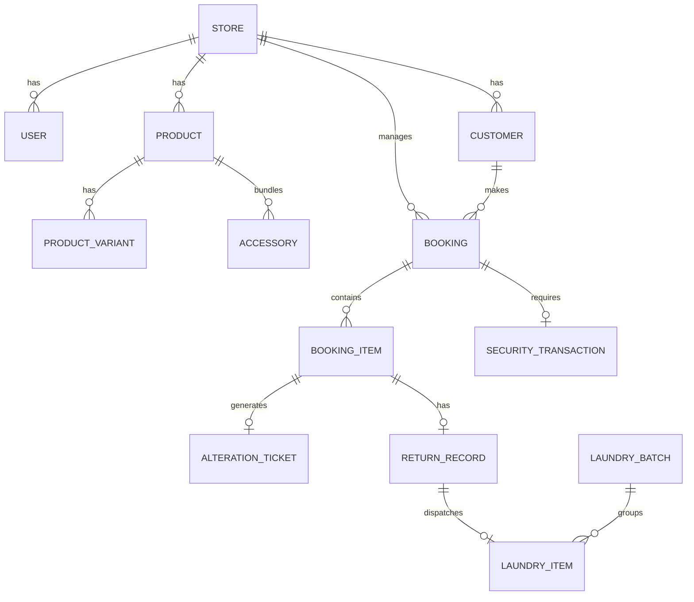

# 🗄️ RentElite OS - Complete Database Architecture

> **હેતુ:** ડેવલપર્સ માટે સંપૂર્ણ રિલેશનલ PostgreSQL ડેટાબેઝ સ્કીમા (Database Schema).  
> આ સ્કીમા મલ્ટી-ટેનન્ટ (Multi-tenant) છે, જેથી એક જ ડેટાબેઝમાંથી સેંકડો ક્લાયન્ટ્સનો ડેટા સુરક્ષિત રહી શકે.

---

## 📐 ER ડાયાગ્રામ (High-Level Schema Map)



---

## 📜 ટેબલ્સ અને ફિલ્ડ્સ (Detailed Tables & Fields)

### 1. `stores` (દુકાન / ટેનન્ટ)
દરેક ક્લાયન્ટ (દા.ત. વિરાસત ફેશન સ્ટુડિયો) માટેનો મુખ્ય રેકોર્ડ.
```sql
CREATE TABLE stores (
    id UUID PRIMARY KEY DEFAULT gen_random_uuid(),
    name VARCHAR(255) NOT NULL,              -- e.g. 'Virasat Fashion Studio'
    slug VARCHAR(100) UNIQUE NOT NULL,       -- e.g. 'virasat-studio'
    phone VARCHAR(20) NOT NULL,
    email VARCHAR(100),
    address TEXT NOT NULL,
    city VARCHAR(100) NOT NULL,              -- Surat, Ahmedabad, etc.
    gst_number VARCHAR(20),
    logo_url TEXT,
    upi_id VARCHAR(100),
    subscription_status VARCHAR(20) DEFAULT 'ACTIVE', -- ACTIVE, EXPIRED, TRIAL
    subscription_expires_at TIMESTAMP WITH TIME ZONE,
    created_at TIMESTAMP WITH TIME ZONE DEFAULT NOW()
);
```

---

### 2. `users` (સ્ટાફ અને રોલ)
એડમિન, મેનેજર, સેલ્સમેન અને માસ્ટરજી માટેનું લોગિન.
```sql
CREATE TABLE users (
    id UUID PRIMARY KEY DEFAULT gen_random_uuid(),
    store_id UUID REFERENCES stores(id) ON DELETE CASCADE,
    name VARCHAR(100) NOT NULL,
    phone VARCHAR(20) UNIQUE NOT NULL,
    password_hash TEXT NOT NULL,
    role VARCHAR(30) NOT NULL,               -- 'SUPER_ADMIN', 'STORE_OWNER', 'SALESMAN', 'TAILOR'
    is_active BOOLEAN DEFAULT TRUE,
    created_at TIMESTAMP WITH TIME ZONE DEFAULT NOW()
);
```

---

### 3. `categories` & `products` (પ્રોડક્ટ કેટલોગ)
```sql
CREATE TABLE categories (
    id UUID PRIMARY KEY DEFAULT gen_random_uuid(),
    store_id UUID REFERENCES stores(id) ON DELETE CASCADE,
    name VARCHAR(100) NOT NULL,              -- 'Sherwani', 'Indo-Western', 'Blazer'
    description TEXT,
    created_at TIMESTAMP WITH TIME ZONE DEFAULT NOW()
);

CREATE TABLE products (
    id UUID PRIMARY KEY DEFAULT gen_random_uuid(),
    store_id UUID REFERENCES stores(id) ON DELETE CASCADE,
    category_id UUID REFERENCES categories(id),
    name VARCHAR(200) NOT NULL,              -- 'Royal Velvet Maroon Sherwani'
    sku_code VARCHAR(50) NOT NULL,           -- 'SH-001'
    description TEXT,
    base_rent_price DECIMAL(10, 2) NOT NULL, -- ₹3,500
    security_deposit DECIMAL(10, 2) NOT NULL,-- ₹5,000
    purchase_cost DECIMAL(10, 2),            -- ₹12,000 (Owner cost)
    primary_image_url TEXT,
    gallery_images JSONB,                    -- Array of image URLs
    is_active BOOLEAN DEFAULT TRUE,
    created_at TIMESTAMP WITH TIME ZONE DEFAULT NOW(),
    UNIQUE(store_id, sku_code)
);
```

---

### 4. `product_variants` (સાઈઝ, કલર & QR કોડ)
```sql
CREATE TABLE product_variants (
    id UUID PRIMARY KEY DEFAULT gen_random_uuid(),
    product_id UUID REFERENCES products(id) ON DELETE CASCADE,
    size VARCHAR(20) NOT NULL,               -- '38', '40', '42'
    color VARCHAR(50) NOT NULL,              -- 'Maroon', 'Pista', 'Beige'
    barcode_qr VARCHAR(100) UNIQUE NOT NULL, -- 'QR-VR-SH-001-38'
    fabric_type VARCHAR(100),                -- 'Raw Silk', 'Velvet'
    total_rent_count INT DEFAULT 0,          -- How many times rented out
    total_earnings DECIMAL(12, 2) DEFAULT 0, -- Total revenue earned by this piece
    status VARCHAR(30) DEFAULT 'AVAILABLE',  -- 'AVAILABLE', 'BOOKED', 'ALTERATION', 'LAUNDRY', 'DAMAGED'
    created_at TIMESTAMP WITH TIME ZONE DEFAULT NOW()
);
```

---

### 5. `accessories` (એક્સેસરીઝ)
```sql
CREATE TABLE accessories (
    id UUID PRIMARY KEY DEFAULT gen_random_uuid(),
    store_id UUID REFERENCES stores(id) ON DELETE CASCADE,
    name VARCHAR(100) NOT NULL,              -- 'Safa', 'Mala', 'Mojdi', 'Kalgi', 'Brooch'
    sku VARCHAR(50) NOT NULL,
    default_rent DECIMAL(10, 2) DEFAULT 0,
    total_quantity INT DEFAULT 1,
    available_quantity INT DEFAULT 1,
    created_at TIMESTAMP WITH TIME ZONE DEFAULT NOW()
);
```

---

### 6. `customers` (ગ્રાહક ડેટાબેઝ)
```sql
CREATE TABLE customers (
    id UUID PRIMARY KEY DEFAULT gen_random_uuid(),
    store_id UUID REFERENCES stores(id) ON DELETE CASCADE,
    full_name VARCHAR(150) NOT NULL,
    phone VARCHAR(20) NOT NULL,
    alternate_phone VARCHAR(20),
    address TEXT,
    id_proof_type VARCHAR(50),               -- 'Aadhaar', 'Driving License'
    id_proof_number VARCHAR(100),
    id_proof_image_url TEXT,
    created_at TIMESTAMP WITH TIME ZONE DEFAULT NOW(),
    UNIQUE(store_id, phone)
);
```

---

### 7. `bookings` & `booking_items` (મુખ્ય બુકિંગ એન્જિન)
```sql
CREATE TABLE bookings (
    id UUID PRIMARY KEY DEFAULT gen_random_uuid(),
    store_id UUID REFERENCES stores(id) ON DELETE CASCADE,
    booking_number VARCHAR(50) UNIQUE NOT NULL, -- 'BK-2026-0001'
    customer_id UUID REFERENCES customers(id),
    salesman_id UUID REFERENCES users(id),
    
    event_date DATE NOT NULL,
    pickup_date TIMESTAMP WITH TIME ZONE NOT NULL,
    expected_return_date TIMESTAMP WITH TIME ZONE NOT NULL,
    actual_return_date TIMESTAMP WITH TIME ZONE,
    
    total_rent_amount DECIMAL(10, 2) NOT NULL,
    discount_amount DECIMAL(10, 2) DEFAULT 0,
    net_rent_amount DECIMAL(10, 2) NOT NULL,
    advance_paid DECIMAL(10, 2) DEFAULT 0,
    balance_due DECIMAL(10, 2) NOT NULL,
    
    security_deposit_amount DECIMAL(10, 2) NOT NULL,
    security_deposit_status VARCHAR(30) DEFAULT 'PENDING', -- 'PENDING', 'HELD', 'REFUNDED', 'DEDUCTED'
    
    booking_status VARCHAR(30) DEFAULT 'CONFIRMED', -- 'CONFIRMED', 'DELIVERED', 'COMPLETED', 'CANCELLED'
    notes TEXT,
    created_at TIMESTAMP WITH TIME ZONE DEFAULT NOW()
);

CREATE TABLE booking_items (
    id UUID PRIMARY KEY DEFAULT gen_random_uuid(),
    booking_id UUID REFERENCES bookings(id) ON DELETE CASCADE,
    product_variant_id UUID REFERENCES product_variants(id),
    rent_rate DECIMAL(10, 2) NOT NULL,
    bundled_accessories JSONB,               -- e.g. [{"name": "Safa", "returned": false}, ...]
    status VARCHAR(30) DEFAULT 'BOOKED'      -- 'BOOKED', 'ALTERED', 'DELIVERED', 'RETURNED'
);
```

---

### 8. `alteration_tickets` (દરજી / માસ્ટરજી સ્લિપ)
```sql
CREATE TABLE alteration_tickets (
    id UUID PRIMARY KEY DEFAULT gen_random_uuid(),
    booking_item_id UUID REFERENCES booking_items(id) ON DELETE CASCADE,
    tailor_id UUID REFERENCES users(id),
    
    chest VARCHAR(20),
    waist VARCHAR(20),
    shoulder VARCHAR(20),
    length VARCHAR(20),
    sleeve_length VARCHAR(20),
    pajama_length VARCHAR(20),
    pajama_waist VARCHAR(20),
    special_instructions TEXT,
    
    deadline_date TIMESTAMP WITH TIME ZONE NOT NULL,
    is_completed BOOLEAN DEFAULT FALSE,
    completed_at TIMESTAMP WITH TIME ZONE,
    created_at TIMESTAMP WITH TIME ZONE DEFAULT NOW()
);
```

---

### 9. `return_records` (ડેમેજ કંટ્રોલ & રિટર્ન)
```sql
CREATE TABLE return_records (
    id UUID PRIMARY KEY DEFAULT gen_random_uuid(),
    booking_item_id UUID REFERENCES booking_items(id) ON DELETE CASCADE,
    checked_by_user_id UUID REFERENCES users(id),
    return_timestamp TIMESTAMP WITH TIME ZONE DEFAULT NOW(),
    
    all_accessories_returned BOOLEAN DEFAULT TRUE,
    missing_accessories_details TEXT,
    
    has_damage BOOLEAN DEFAULT FALSE,
    damage_description TEXT,
    damage_penalty_amount DECIMAL(10, 2) DEFAULT 0,
    damage_photo_urls JSONB,                 -- Photos of stains or tears
    
    late_return_days INT DEFAULT 0,
    late_fee_amount DECIMAL(10, 2) DEFAULT 0,
    
    deposit_refunded DECIMAL(10, 2) NOT NULL,
    refund_payment_mode VARCHAR(30)          -- 'CASH', 'UPI', 'BANK'
);
```

---

### 10. `laundry_management` (ડ્રાયક્લીનિંગ & વોશિંગ)
```sql
CREATE TABLE laundry_batches (
    id UUID PRIMARY KEY DEFAULT gen_random_uuid(),
    store_id UUID REFERENCES stores(id) ON DELETE CASCADE,
    batch_number VARCHAR(50) UNIQUE NOT NULL, -- 'LAUND-2026-089'
    vendor_name VARCHAR(150) NOT NULL,        -- 'Surat Royal Dry Cleaners'
    sent_date DATE DEFAULT CURRENT_DATE,
    expected_return_date DATE NOT NULL,
    total_items INT DEFAULT 0,
    total_cost DECIMAL(10, 2) DEFAULT 0,
    is_received BOOLEAN DEFAULT FALSE,
    received_date DATE
);

CREATE TABLE laundry_items (
    id UUID PRIMARY KEY DEFAULT gen_random_uuid(),
    laundry_batch_id UUID REFERENCES laundry_batches(id) ON DELETE CASCADE,
    product_variant_id UUID REFERENCES product_variants(id),
    status VARCHAR(30) DEFAULT 'IN_CLEANING', -- 'IN_CLEANING', 'READY_FOR_PICKUP', 'RETURNED_TO_STOCK'
    notes TEXT
);
```

---

### 11. `cashbook_transactions` (દૈનિક હિસાબ-કિતાબ)
```sql
CREATE TABLE cashbook_transactions (
    id UUID PRIMARY KEY DEFAULT gen_random_uuid(),
    store_id UUID REFERENCES stores(id) ON DELETE CASCADE,
    transaction_type VARCHAR(20) NOT NULL,   -- 'INCOME', 'EXPENSE', 'DEPOSIT_IN', 'DEPOSIT_REFUND'
    category VARCHAR(50) NOT NULL,          -- 'RENT_PAYMENT', 'LAUNDRY_BILL', 'TEA_EXPENSE', etc.
    amount DECIMAL(10, 2) NOT NULL,
    payment_mode VARCHAR(30) NOT NULL,      -- 'CASH', 'UPI_GPAY', 'BANK_TRANSFER'
    booking_id UUID REFERENCES bookings(id),
    recorded_by_user_id UUID REFERENCES users(id),
    remarks TEXT,
    created_at TIMESTAMP WITH TIME ZONE DEFAULT NOW()
);
```

---

## ⚡ ડબલ બુકિંગ અટકાવવા માટેનો SQL Index
```sql
-- આ Index લગ્નની એક જ તારીખે એક જ શેરવાની બીજી વાર બુક થવા દેશે નહીં
CREATE INDEX idx_booking_variant_dates ON bookings (pickup_date, expected_return_date);
CREATE INDEX idx_product_variant_status ON product_variants (store_id, status);
```
