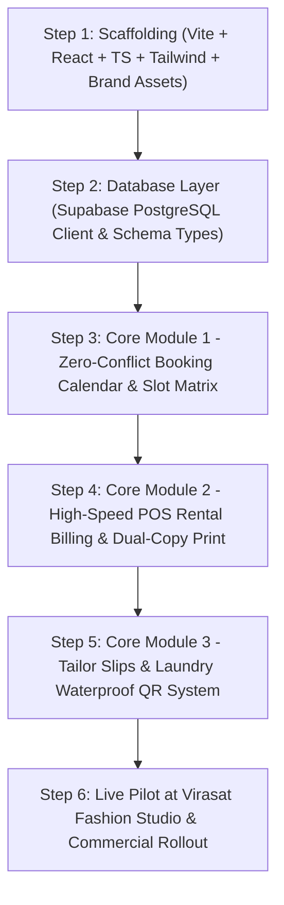

# 📖 RENT360 — PROJECT JOURNAL, HISTORY & MASTER ROADMAP
> **Brand:** Rent360 (Powered by InfoFriends Technology / Info360 Ecosystem)  
> **Key Stakeholders & Team:**  
> • **Yash Babariya:** Women's Wear Boutique Owner & IT Full Stack Developer  
> • **Harsh Savaliya:** Partner at *Virasat - The Fashion Studio* (Anchor Proving Ground)  
> • **Shridhar Savaliya:** Professional Accountant & IT Full Stack Developer (Finance, Ledgers & Core Engineering)  
> **Anchor Proving Ground:** Virasat - The Fashion Studio, Gujarat (100% Lifetime Free Gift)  
> **Target Market:** Luxury Wedding Attire & Men's Ethnic Rental Boutiques across Gujarat & India  
> **Subscription Pricing:** ₹9,999/Year (Disrupting Rentopus at ₹15,999/yr)  
> **Tech Stack:** React 18 + Vite + TypeScript + Tailwind CSS + Supabase (PostgreSQL)

---

## 💎 The Unfair Competitive Advantage
Traditional software companies build rental tools by guessing what boutique owners need.  
**Rent360 is engineered by actual boutique owners, accountants, and full stack developers:**
1. **Retail & Garment Shop Mastery (Yash Babariya):** Runs an active Women's Wear shop — knows garment sizing, fabrics, alterations, customer trials, damage disputes, and daily retail counter operations inside-out. Also an IT Full Stack Developer.
2. **Accounting & Full Stack Software Architecture (Shridhar Savaliya):** Professional Accountant AND Full Stack Developer — ensures bulletproof security deposit ledgers, GST invoices, profit-loss tracking, and high-performance backend/frontend architecture.
3. **Studio Ground Operations (Harsh Savaliya):** Partner at *Virasat - The Fashion Studio* — brings real on-ground rental boutique customer trials, booking rush, and daily showroom feedback.
4. **Dual Full-Stack Developer Powerhouse (Yash & Shridhar):** Deep technical architecture backed by real-world retail and financial accounting expertise.

---

## 📅 Part 1: Historical Timeline & Daily Progress Log

### 🗓️ 25 September 2026 — The Spark & Industry Realization
- **The Event:** Harsh Savaliya was evaluating an existing rental software demo at *Virasat - The Fashion Studio*.
- **The Insight:** Harsh and Yash evaluated competitor *Rentopus*. Combining Yash's women's wear retail & full stack engineering expertise, Harsh's direct on-ground studio experience at *Virasat*, and Shridhar's accounting mastery, they realized:
  1. Off-the-shelf software is slow, bloated, overpriced (₹16,000+), and built by people who have never operated a garment shop counter.
  2. Double-booking errors, messy security deposit calculations, and lack of tailor coordination cost studios real money and reputation.
- **The Decision:**
  1. Build a custom, ultra-fast, zero-lag software (**Rent360**).
  2. Gift it **100% Lifetime Free** to *Virasat - The Fashion Studio* as the permanent testing lab.
  3. Productize and roll it out to all wedding attire rental businesses across Gujarat for **₹9,999/year** with verified laptop hardware support.

---

### 🗓️ 26 September 2026 — Reverse-Engineering Competitor Architecture
- **The Action:** Built an automated Playwright crawler tool (`SiteSnapPro`) in Python.
- **Deliverables:**
  - Crawled all **54 routes** of the competitor app (`shop.whitecoretechnology.com`).
  - Captured 54 full-page desktop screenshots (`page_001.png` to `page_054.png`).
  - Extracted JSON structural metadata (`rentopus_admin_data.json`) covering 52+ functional menus, form inputs, billing workflows, and buttons.
  - Pinpointed all critical failures: missing atomic date-locks, confusing security deposit refund ledgers, and clunky tailoring communication.

---

### 🗓️ 27 – 28 September 2026 — Master Architecture & Specification Blueprints
- **Deliverables Created:**
  - `README.md`: Master specification detailing the 6-stage garment rental lifecycle (Enquiry ➔ Booking ➔ Alteration ➔ Pickup ➔ Return/Inspection ➔ Laundry/Stock).
  - `DATABASE_SCHEMA.md`: Multi-tenant PostgreSQL architecture with mathematical exclusion constraints (`EXCLUDE USING gist`) guaranteeing zero double-bookings, tenant data isolation, and deposit ledgers.
  - `SYSTEM_ARCHITECTURE.md`: High-speed API architecture, WhatsApp Cloud API templates, waterproof QR laundry tags, and thermal 80mm dual-copy receipt engine.
  - `DETAILED_MODULE_BREAKDOWN_AND_BILLING.md`: Complete thermal (80mm) and A4 invoice formats with rental terms and tailor measurement slips.

---

### 🗓️ 29 – 30 September 2026 — Design System & Brand Identity Evolution
- **Design Philosophy:**
  - Eliminated messy, tiring multi-color gradients.
  - Adopted the **92/8 Clean Minimalist Rule**:
    - **92% Clean Monochrome:** Pure Pitch Black (`#000000`) for Dark Mode, Clean White (`#FFFFFF`) for Light Mode to prevent eye fatigue during 8–10 hour counter shifts.
    - **8% Surgical Clean Solid Blue (`#0B60B0`):** Reserved strictly for active indicators, status badges, and primary action buttons.
  - Typography: `Sora` (Headings/Financials) + `Plus Jakarta Sans` (UI/Body) + `Inter` (Data).
  - Button Radii: 6px clean rounded vs 0px sharp.
  - Pure SVG vector icons (strictly zero emojis) + English UI labels.
  - Built interactive test harness: `theme_preview.html`.
- **Brand Assets:**
  - Integrated official Rent360 brand assets into `Rent360/` directory:
    - `Rent360_Black.png`, `Rent360_White.png`, `Rent360_icon_Black.png`, `Rent360_icon_White.png`.

---

### 🗓️ 01 October 2026 (Today) — Tech Stack Locking & Execution Launch
- **Framework Choice:**
  - Rejected Next.js (too heavy, bloated, dev server lag).
  - **Locked Winner:** **React 18 + Vite + TypeScript + Tailwind CSS** (Blazing fast, instant <50ms HMR, lightweight SPA).
  - **Backend & Database:** **Supabase (PostgreSQL)** for ACID-compliant transactions, real-time live availability sync, and tenant isolation.

---

## 🗺️ Part 2: Step-by-Step Execution Plan

---

## 🎯 Next Immediate Action: Step 1 (Project Scaffolding)
1. Initialize `React 18 + Vite + TypeScript` project in the workspace.
2. Configure Tailwind CSS with the design tokens (`#000000`, `#FFFFFF`, `#0B60B0`, `#40A2D8`) and typography (`Sora`, `Plus Jakarta Sans`).
3. Wire the official `Rent360_White.png` and `Rent360_Black.png` logos into the master layout header.
4. Establish clean folder architecture (`components/`, `modules/`, `types/`, `lib/`).
